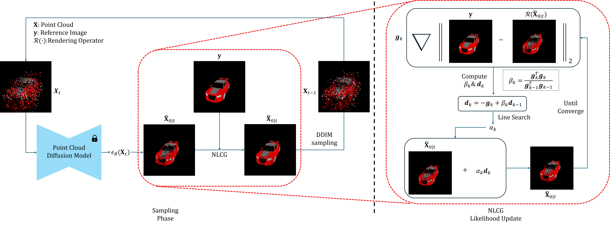
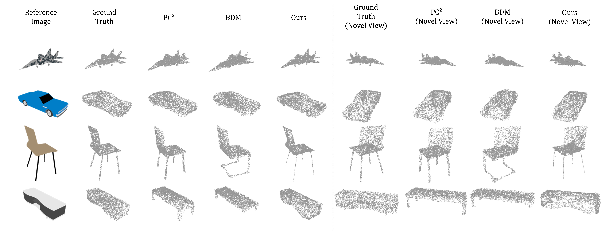
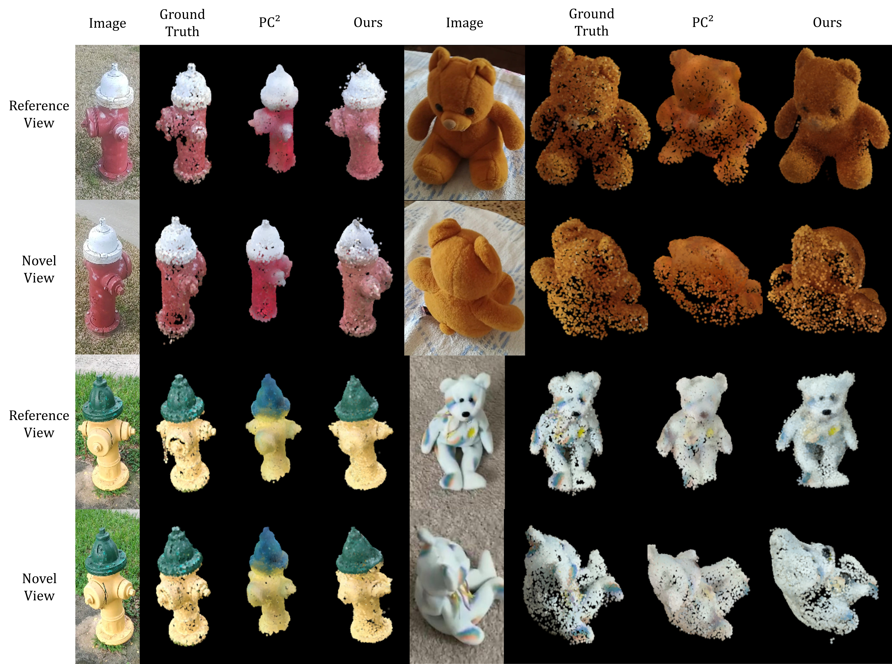

<div align="center">

## Adaptive 3D Reconstruction via Diffusion Priors and Forward Curvature-Matching Likelihood Updates (NeurIPS 2025 (Spotlight))
[](https://arxiv.org/abs/2511.06310) [](https://neurips.cc/virtual/2025/loc/san-diego/poster/118820)


</div>

## Table of Contents

- [Overview](#overview)
  - [Abstract](#abstract)
  - [Method](#method)
  - [Examples](#examples)
- [Running the Code](#running-the-code)
  - [Environment](#environment)
  - [Pretrained Checkpoints & data](#pretrained-checkpoints-data)
  - [Sampling](#sampling)
- [Acknowledgement](#acknowledgement)
- [Citation](#citation)

## Overview

### Abstract

Reconstructing high-quality point clouds from images remains challenging in computer vision. Existing generative models, particularly diffusion models, based approaches that directly learn the posterior may suffer from inflexibility—they require conditioning signals during training, support only a fixed number of input views, and need complete retraining for different measurements. Recent diffusion-based methods have attempted to address this by combining prior models with likelihood updates, but they rely on heuristic fixed step sizes for the likelihood update that lead to slow convergence and suboptimal reconstruction quality. We advance this line of approach by integrating our novel Forward Curvature-Matching (FCM) update method with diffusion sampling. Our method dynamically determines optimal step sizes using only forward automatic differentiation and finite-difference curvature estimates, enabling precise optimization of the likelihood update. This formulation enables high-fidelity reconstruction from both single-view and multi-view inputs, and supports various input modalities through simple operator substitution—all without retraining. Experiments on ShapeNet and CO3D datasets demonstrate that our method achieves superior reconstruction quality at matched or lower NFEs, yielding higher F-score and lower CD and EMD, validating its efficiency and adaptability for practical applications.

### Method

Overview of our FCM-guided point cloud diffusion sampling framework. The FCM likelihood update illustrates our key innovation dynamically determining optimal step sizes for the likelihood gradient $\nabla||y-R(\hat{X}_{0|t})||_2$. This principled optimization approach enables high-fidelity reconstruction that accurately matches input images.

### Examples



## Running the Code

### Environment
We provide a conda-based setup tested with Python 3.10 and PyTorch 2.4.1.

#### 1. Create and activate conda environment and install pytorch

```bash
conda create -n FCM python=3.10
conda activate FCM
conda install \
  pytorch==2.4.1 \
  torchvision==0.19.1 \
  pytorch-cuda=11.8 \
  -c pytorch -c nvidia
```

#### 2. Clone this repository and install Python dependencies
```bash
git clone https://github.com/Seunghyeok0715/FCM.git
cd FCM
pip install --no-build-isolation -r requirements.txt
```

#### 3. Install PyTorch3D
We install PyTorch3D from the official GitHub repository instead of using`pip install pytorch3d`, since the prebuilt wheels often cause version conflicts with the specific PyTorch / CUDA combination used in this project.
```bash
git clone https://github.com/facebookresearch/pytorch3d.git
cd pytorch3d
pip install --no-build-isolation -e .
```

### Pretrained Checkpoints & data
You can download the pretrained models and data from the following links:

- **Rendered ShapeNet images**: [Download](https://drive.google.com/file/d/1HbEdoWSgJPPT2i6-OMNrDMA4ytLzdfKB/view?usp=drive_link)

- **Ground-truth point clouds**: [Download](https://drive.google.com/file/d/1gc5MxJhVN5xVGjE_cJ1b2xWkrVTYA2mF/view?usp=drive_link)

- **Model checkpoints**: [Download](https://drive.google.com/drive/folders/1oVsciyTtb8Z3xa0gSTXCpanZD9pvKPT3?usp=drive_link)

- **Upsampling model**: [Download](https://drive.google.com/file/d/1APr6WALQz_jWxVVw0Aun2Gqf60ihy_RS/view?usp=drive_link)

### Sampling
To run sampling with the pretrained models, use the following commands.

#### Airplane
Set the radius to `0.018`:

```bash
python main.py \
  --gt_dir /path/to/test_ply \ 
  --data_dir /path/to/albedo/test \
  --upsample_model /path/to/pugan_best.pth \
  --model /path/to/airplane.pth \
  --object airplane \
  --data_lists FCM/data_lists/matched_files_airplane.txt \
  --radius 0.018 \
  --N_view 1
```

#### Car
Set the radius to `0.027`:

```bash
python main.py \
  --gt_dir /path/to/test_ply \
  --data_dir /path/to/albedo/test \
  --upsample_model /path/to/pugan_best.pth \
  --model /path/to/car.pth \
  --object car \
  --data_lists FCM/data_lists/matched_files_car.txt \
  --radius 0.027 \
  --N_view 1
```

Here, `N_view` denotes the number of input measurement images used for reconstruction.

### Acknowledgement
Our implementation is based on the Point-E model and training pipeline provided by OpenAI's repository: [Point-E](https://github.com/openai/point-e).
The rendered ShapeNet images (albedo, resolution 224×224) are obtained from [ShapenetRender_more_variation](https://github.com/Xharlie/ShapenetRender_more_variation).
The ground-truth point clouds are taken from the PointFlow dataset from [PointFlow](https://github.com/stevenygd/PointFlow).
The point cloud upsampling model is adopted from [RepKPU](https://github.com/EasyRy/RepKPU).

We thank the authors of these works for releasing their code and data.

### Citation

```bash
@inproceedings{shin2025FCM,
  author    = {Shin, Seunghyeok and Kim, Dabin and Lim, Hongki},
  title     = {Adaptive 3D Reconstruction via Diffusion Priors and Forward Curvature-Matching Likelihood Updates},
  booktitle = {The Thirty-Ninth Annual Conference on Neural Information Processing Systems},
  year      = {2025},
  url       = {https://openreview.net/forum?id=IJLqUjtrls}
}  
```